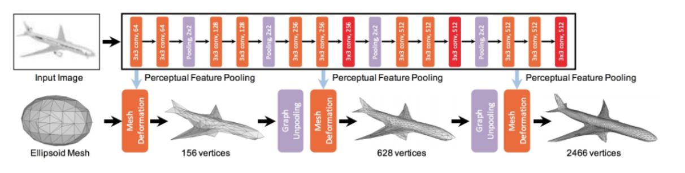

# Introduction

## Overview

Pixel2Mesh employs a deep learning approach centered around **GCNs** (Graph Convolutional Networks). The process begins with a **convolutional neural network** extracting rich visual features from the input image. These features, along with the initial **template mesh**, are then fed into a series of GCN layers, which slowly deform the template mesh to match the shape within the image. **Mesh pooling layers** help to downsample the mesh throughout the process, enabling a coarse-to-fine approach (look at the image above). 

The model is trained by comparing the predicted 3D mesh to a **ground truth mesh** (hence the paired dataset), using a **loss function** that incorporates:
- **Chamfer distance**
- **Edge length loss**
- **Normal loss**
- **Deformation** and **refinement**

---

## Key Components

### Image Encoder
The image encoder takes in the input 2D image and extracts a rich set of features that capture important visual information about the object's shape, appearance, and context.

- **Implementation**: Uses a CNN like ResNet or VGG. In PyTorch, this involves using `Conv2D`, `MaxPool2d`, and `BatchNorm2d`.
- **Output**: Feature map—a multichannel representation of the image.

---

### Mesh Decoder
This is the GCN part of the model. It takes an image feature map from the image encoder and an initial **template mesh** (e.g., a sphere,ellipsoid or icosphere) as inputs and iteratively deforms the template mesh to match the shape represented in the image. (refer to bottom right of image at top of page)

- **Structure**: A series of GCN layers, each followed by a **mesh pooling layer** to perform downsampling of the mesh. In PyTorch, `torch.nn.Module` is used to perform message passing/vertex updates based on neighbors.

---

### Template Mesh
The **template mesh** is a predefined 3D mesh that serves as the starting point. It is stored as tensors in PyTorch, and operations on it are performed. Feature extraction works with `torch.nn.Linear`, `torch.nn.ReLU`, and `torch.nn.BatchNorm1d`.

---

### Loss Function
The **loss function** measures how well the predicted mesh matches the ground truth 3D shape. It provides a learning signal that guides the model's training. PyTorch functionality is used to calculate these loss functions.

#### Loss Functions Used to Train the Model and Guide Mesh Generation:

- **Chamfer**: Measures the distance between each vertex in the predicted mesh and the closest vertex in the ground truth mesh, and vice versa.
  
- **Normal**: This advanced loss enforces consistency between the predicted and ground truth mesh.
  
- **Laplacian**: Prevents vertices from moving too freely, avoiding deformations or intersections in the mesh. Helps with smoothness by calculating how much vertices move relative to their neighbors using Laplacian coordinates.
  
- **Edge**: Prevents vertices from flying away or creating overly long edges in the mesh. It penalizes any large changes in edge length to ensure the mesh is tightly connected.

---

For more details, visit the [Pixel2Mesh-Pytorch GitHub repository](https://github.com/Wapity/Pixel2Mesh-Pytorch/tree/master/tensor). This PyTorch implementation is based on the original Pixel2Mesh implementation.

