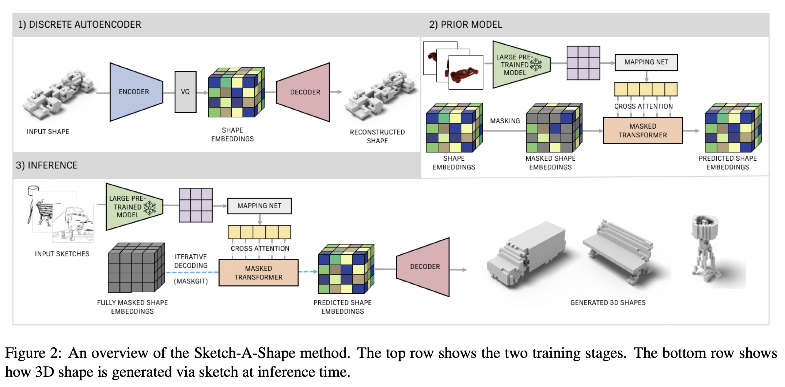

# Introduction 
[[arXiv]](https://arxiv.org/abs/2307.03869)
[[pdf]](https://arxiv.org/pdf/2307.03869)  
This paper recognizes that there is a use for large pre-trained models in text-to-shape generation, and applies this 
logic to sketch-to-shape generation as a way to circumvent the limited amount of paired sketch/shape datasets in 
existence.

This approach demonstrates the effectiveness of a large pre-trained model to pick up on the semantic features of a 
sketch drawing allowing for shape generation without the paired sketch/shape dataset. 
## Zero Shot Transfer Learning
Zero Shot Learning leverages large pre-trained 2D-image/text models in downstream 3d vision tasks as seen with 
text-to-3d shape generation. This paper is noted as the first to try to leverage this capability for 2d image-to-3d 
shape generation.

## Overview of Approach

### Stage I - Discrete Auto Encoder
Initially, we start out by training an auto-encoder to compress and decompress 3d shapes. The research paper adopts the 
VQVAE structure for this model.

### Stage II - Prior Model
For this step, images are fed into the pre-trained model and tailor fit into the compressed shape embeddings of the 
auto-encoder trained in Stage I. The research paper implements this with a combination of mapping network, self 
attention heads and a bi-directional transformer approach.

### Inference - Shape Generation
During inference, we feed sketches into the large pre-trained model. The semantic features picked by by the large 
pre-trained model are processed by the model trained in Stage II. This provides us with the compressed shape embeddings
consistent with the auto-encoder trained in Stage I, from which we can use the decoder to obtain the final 3d shape 
rendering.